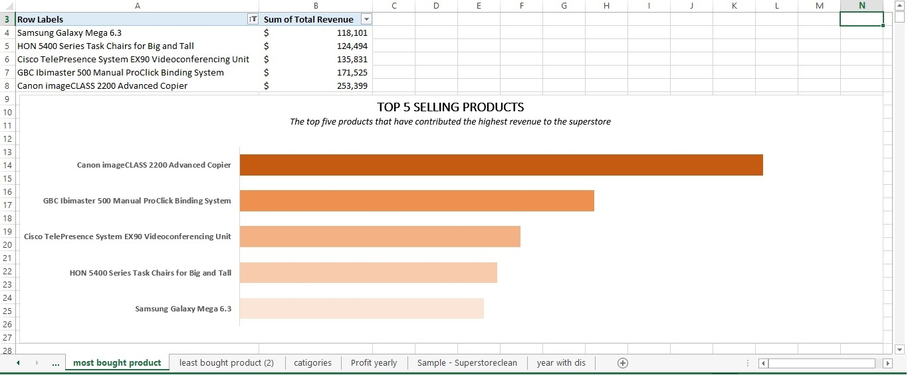
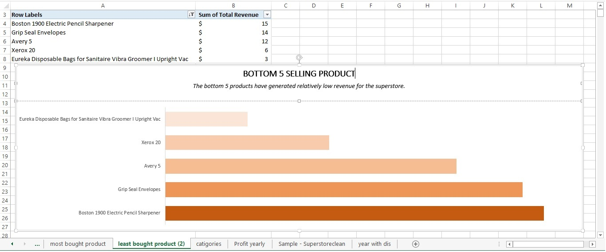
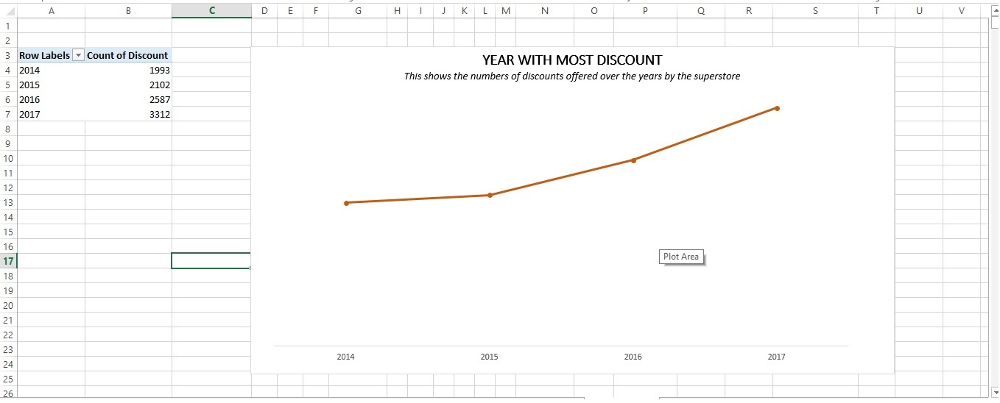
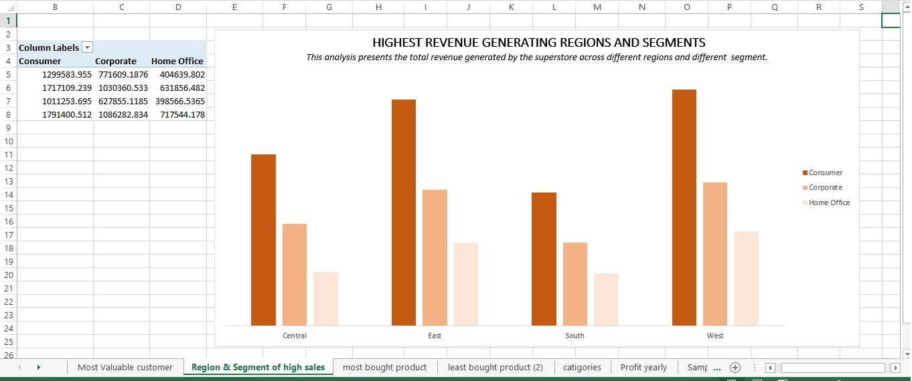
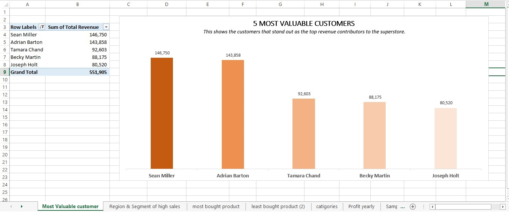
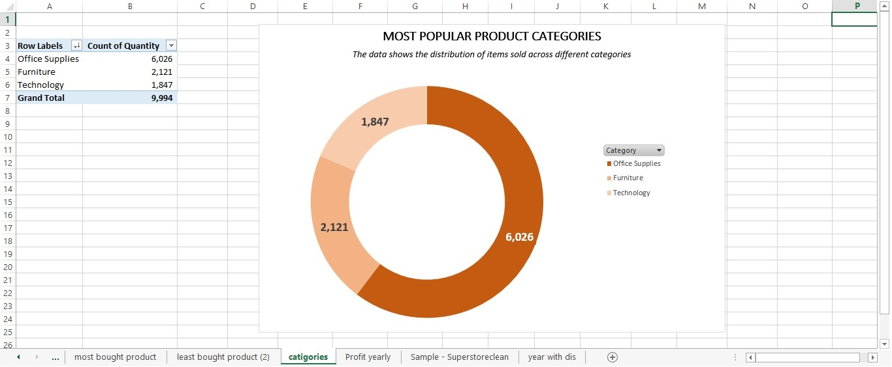
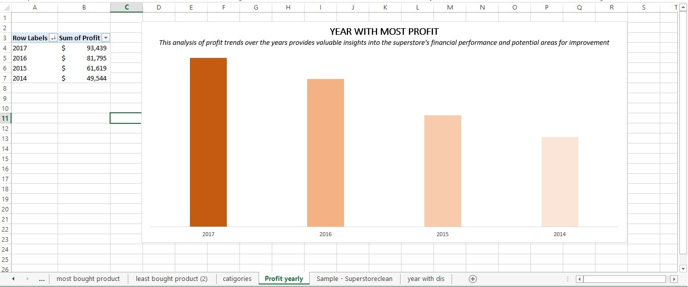

# U.S-SUPERSTORE-SALES-DATA

## Description 
The analysis carried out on the U.S. Superstore Sales Data was extensive, encompassing various critical aspects of the superstore's sales and operational performance. The primary objective of the analysis was to gain valuable insights into the business by exploring all relevant variables available in the dataset. Some of the key variables examined in the analysis included sales revenue, product categories, customer information, shipping details, discounts, and profits, among others.

## Data Set 
The data set used is the U.S. Superstore Sales data, which is a single data file in a comma-separated values (CSV) format. Each row in the dataset represents a unique record, containing relevant variables pertaining to the sales transactions at the superstore. The dataset is structured with columns containing different information for each record. 

### Data Preprocessing/Cleaning 
The dataset was imported into Microsoft Excel for cleaning. The dataset was checked for duplicates, invalid entries, missing values, incorrect data types and issues from data entry. 
No duplicates were found, and incorrect column data types were changed to the appropriate data types, e.g. date column having a number data type was changed to the date data type to ensure accuracy in analysis. A new column was added to the data set named “Total Revenue” by multiplying each row in the “Sales” column with each row “Quantity” column. I.e. S2*T2

##Data Analysis 
The analysis of the U.S. Superstore Sales Data aims to gain valuable insights into the superstore's sales and operational performance. By exploring all relevant variables available in the dataset, several business questions were answered to better understand and optimize the superstore's operations. Here are a few such questions:

#### Identify the top 5 selling products and bottom 5 selling products in terms of revenue generated.
This task was done by dragging the "Total Revenue" column in the "Values" section of the pivot table, while the "Product Name" column was placed in the "Rows" section of the pivot table field. By doing so, the pivot table automatically aggregated the data, providing the sum of revenue for each product sold. Then pivot chart was used to give a virtual representation of the data.

-	Insight 
The analysis highlights the products that have the potential to significantly contribute to the superstore's revenue. These top-selling products can be considered as high-value items with strong market demand.  The Canon image CLASS 2200 Advanced Copier having the highest revenue, indicating its popularity and strong sales performance. This may be due to its advanced features, competitive pricing, or strong demand in the market.

The low revenue figures indicate that these products may not be in high demand among customers. It suggests that there is limited interest or need for these specific products.

#### Which year did superstore gave more discount?
This task was done by placing the "discount" column in the "Values" section of the pivot table, while the "Order Date" column was placed in the "Rows" section of the pivot table field. By doing so, the pivot table automatically aggregated the data, providing the sum of profit for order, then when ahead to “Group” area on the ribbon to group the order made yearly to achieve the profit made yearly. Then pivot chart was included to give a virtual representation of the data

- Insight 

The data shows an increasing trend in the number of discounts offered by the superstore over the years. The number of discounts has consistently grown from 1993 in 2014 to 3312 in 2017. The increasing number of discounts could have a significant impact on the superstore's sales by optimizing its pricing and promotional strategies.

#### Determine the highest revenue generating regions and segments?

This task was done by dragging the "Total Revenue" column in the "Values" section of the pivot table, while the "Region" column was placed in the "Rows" section and “Segment” column was placed of the “Column” section of the pivot table field. By doing so, the pivot table automatically aggregated the data, providing the sum of revenue for each region and segment. Then pivot chart was used to give a virtual representation of the data

-	Insight 

The data reveals the total revenue generated by the superstore in four different regions: Central, East, South, and West. The West region stands out as the highest revenue-generating region, followed by the East, Central, and South regions. The revenue data is further segmented based on three segments: Consumer, Corporate, and Home Office. Across all regions, the consumer segment consistently generates the highest revenue, followed by the corporate and Home Office segments.
The analysis shows that the West region has the highest revenue across all customer segments, suggesting potential growth opportunities in this region. Understanding the factors contributing to its success can help in replicating strategies in other regions. Recognizing the customer segment as the highest revenue generator, the superstore can focus its marketing efforts and sales strategies to attract and retain consumer clients.

#### Identify the 5 most valuable customer in terms of total spending.

This task was done by dragging the "Total Revenue" column in the "Values" section of the pivot table, while the "Customer Name” column was placed in the "Rows" section of the pivot table field. By doing so, the pivot table automatically aggregated the data, providing the sum of spending by each customer. Then pivot chart was used to give a virtual representation of the data

-	Insight

Among all the customers, Sean Miller and Adrian Barton stand out as the top revenue contributors to the superstore. They generated significant revenue of $146,750 and $143,858, respectively. Sean Miller and Adrian Barton's consistent high spending over time suggests their loyalty to the superstore. These loyal customers are crucial for the store's long-term success.

#### Identify the most popular product categories based on the quantity sold

This task was done by placing the "Quantity" column in the "Values" section of the pivot table, while the "Category" column was placed in the "Rows" section of the pivot table field. By doing so, the pivot table automatically aggregated the data, providing the count of quantity for each category. Then pivot chart was used to give a virtual representation of the data

- Insight 

This analysis shows that the office Supplies category is the category with the highest numbers of quantity sold, reaching 6,026 items. This indicates that customers tend to purchase a larger volume of office-related products. Furniture and Technology categories follow with 2,121 and 1,847 items sold, respectively. While these categories have lower quantities sold compared to Office Supplies, they still make significant contributions to the overall sales.

#### In what year did the Superstore made more profit?
This task was done by placing the "Profit" column in the "Values" section of the pivot table, while the "Order Date" column was placed in the "Rows" section of the pivot table field. By doing so, the pivot table automatically aggregated the data, providing the sum of profit for order, then when ahead to “Group” area on the ribbon to group the order made yearly to achieve the profit made yearly. Then pivot chart was used to give a visual representation of the data

-	Insight 

This shows that the year 2017 stands out with the highest profit of $93,439. This indicates a strong financial performance and potential for continued growth in the subsequent years. From 2014 to 2017, there is a positive trend in profit growth, indicating the superstore's improving financial performance.  The increasing profit trend suggests that the superstore's business strategies, cost management, and revenue generation efforts have been effective in driving profitability.

## Tool Used
This analysis was done using Microsoft Excel

## Conclusion
The analysis carried out on the U.S. Superstore Sales Data provided valuable insights into various aspects of the superstore's sales and operational performance. By leveraging these insights the superstore can stay competitive, improve profitability, and continue to provide exceptional products and services to its customers.
